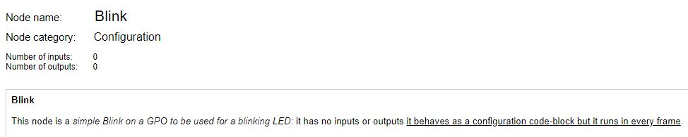

 # nBlocksStudio Blink 
 ## NODE
 There is a set of predefined NODEs. 
 
 The purpose of this node in a Diagram is to Blink an LED.  
 You only need Blink node to create a working Blink program (...or embedded board Hello World).

 Author: Nikos Chalikias  
